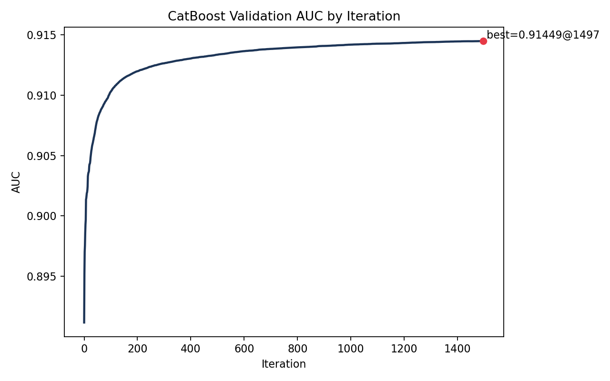
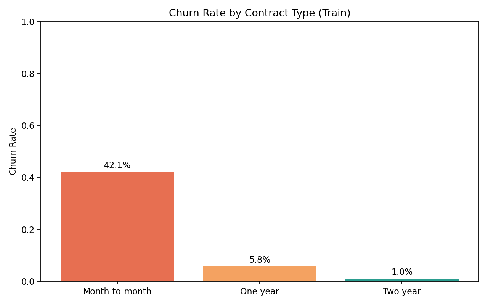
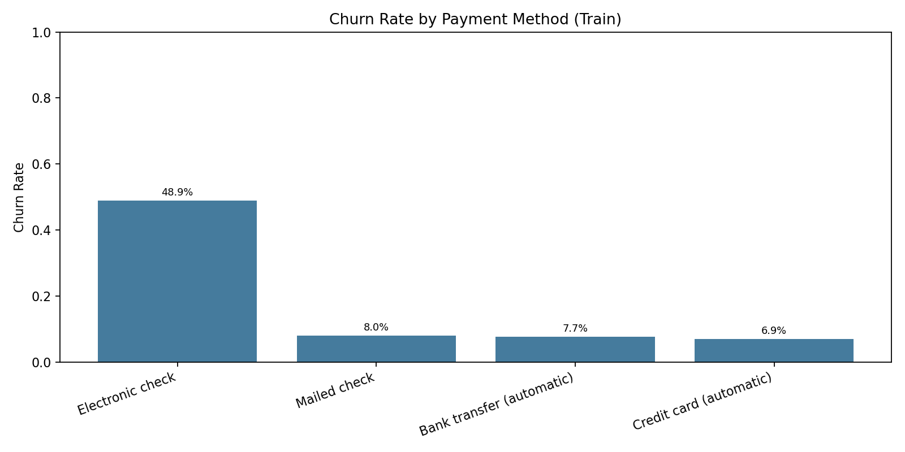
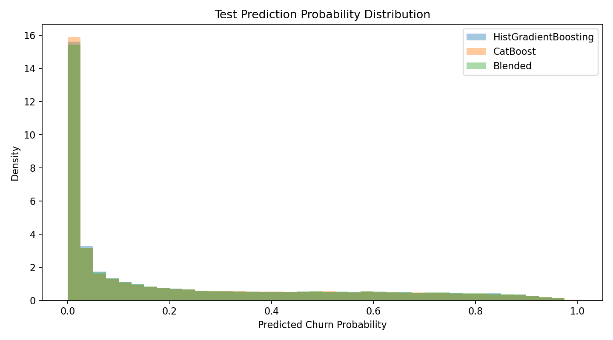

# kaggle_Predict_Customer_Churn
This is a self-study project. The Kaggle competition ‘Predict Customer Churn’ started on March 1, 2026. I’m using it to practice forecasting a binary classification problem. Traditionally, logistic regression is used for this type of task, but now we can also try more advanced machine learning models.

Approach 1:  HistGradientBoostingClassifier
Accuracy: 0.91297

Approach 2: Since we have many categorical vars in the training dataset, we should try catboost model.
Accuracy: 0.91341

I took average of the two prediction scores from these two models, the accuracy improved to 0.91346

### 1) Dataset Signal Summary

- Overall churn rate in training set: **22.52%**
- Churn rate by contract:
	- Month-to-month: **42.05%**
	- One year: **5.76%**
	- Two year: **1.00%**

These patterns strongly match business intuition: shorter contract commitment is associated with higher churn risk.

### 2) CatBoost Training Curve (from `catboost_info/test_error.tsv`)

- Peak validation AUC observed in training log: **0.91449**
- Peak iteration: **1497**

### 3) Churn Behavior Graphs (Train Set)

#### Churn Rate by Contract Type

#### Churn Rate by Payment Method

### 4) Prediction Distribution Comparison (Test Set)

Compared probability distributions across:

- HistGradientBoosting submission (`submission2.csv`)
- CatBoost submission (`submission/submission_advanced2.csv`)
- Blended submission (`submission/submission_combine_max.csv`)

Summary statistics:

- HistGradientBoosting: mean=**0.21821**, std=**0.27456**, p90=**0.69014**
- CatBoost: mean=**0.21810**, std=**0.27437**, p90=**0.68755**
- Blended: mean=**0.22450**, std=**0.27847**, p90=**0.70276**

### 5) Notes

- The blended predictions are slightly more spread out (higher std and p90), which can indicate stronger confidence on high-risk customers.
- Local curves and distribution analysis support your current model choice and blending strategy.

